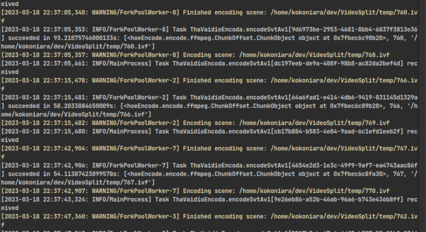

# My vadeio encoda

this is my attempt at encoding in a multi pc setup, currently supports svtav1



## **WARNING: THIS IS A WORK IN PROGRESS, IT MAY NOT WORK, IT MAY EAT YOUR FILES, IT MAY EAT YOUR PC

# Installation

* `pip install alabamaEncoder`
* For basic usage make sure `SvtAv1EncApp`/`ffmpeg`/`ffprobe` are available on your path (you can use them in cli),
  otherwise the program will crash if something is missing

# CLI

if running celery the celery broker ip should be under `REDIS_HOST` env var,
eg `REDIS_HOST=192.168.1.10 alabamaEncoder worker 10`  
otherwise assumed to be `localhost`

for workers:

````
alabamaEncoder worker [# of worker processes] 
````

for general:

````
alabamaEncoder [-h] [INPUT FILE] [OUTPUT FILE] [flags]
````

note: multiple files will be created in the output file's folder

To clear the celery queue: `alabamaEncoder clear`

| argument                      | type  | default                                                                   | description                                                                                                                                        |
|-------------------------------|-------|---------------------------------------------------------------------------|----------------------------------------------------------------------------------------------------------------------------------------------------|
| -h, --help                    |       |                                                                           | show help                                                                                                                                          |
| --encode_audio                | flag  | True                                                                      | mux+transcode audio into the output video                                                                                                          |
| --audio_params                | str   | "-c:a libopus -ac 2 -b:v 96k -vbr on -lfe_mix_level 0.5 -mapping_family 1 | params for audio, eg `-c:v libopus -ac 6`                                                                                                          |
| --celery                      | flag  | False                                                                     | run encode on celery cluster                                                                                                                       |
| --autocrop                    | Flag  | False                                                                     | automatically detect black bars and crop them                                                                                                      |
| --video_filters               | str   | ""                                                                        | override ffmpeg vf params, put your `-vf crop=...` or even a filter_graph, mutually exclusive with scale & crop strings                            |
| --bitrate                     | int   | 2000                                                                      | video bitrate, eg `--bitrate 1000` for 1000kb/s, use `auto` for auto bitrate picking                                                               |
| --vbr_perchunk_optimisation   | Flag  | True                                                                      | auto adjust a chunks vbr bitrate to hit ssim target                                                                                                |
| --crf                         | int   | -1                                                                        | crf to use in crf encode mode                                                                                                                      |
| --encoder                     | str   | SVT_AV1                                                                   | pick a encoder, options are "svt_av1", "x265", "aomenc", "x264"                                                                                    |
| --grain                       | int   | -1                                                                        | grain synth, `-1` for auto, `-2` for auto per chunk, only supported in aomenc, svtav1encapp                                                        |
| --vmaf_target                 | float | 96                                                                        | what vmaf to target with auto ladder                                                                                                               |
| --max_scene_length            | int   | 10                                                                        | dont allow scenes longer than this, in seconds                                                                                                     |
| --crf_based_vmaf_targeting    | flag  | True                                                                      | Target vmaf by adjusting vmaf and calculation score                                                                                                |
| --auto_crf                    | flag  | False                                                                     | Find a crf that hits target vmaf, calculate a peak bitrate cap, and encode using CRF VBV                                                           |
| --chunk_order                 | str   | sequential                                                                | Encode order of scenes: `random`, `sequential`, `length_desc`, `length_asc`, `sequential_reverse`                                                  |
| --start_offset                | int   | -1                                                                        | Offset from the beginning of the video (in seconds), useful for cutting intros etc                                                                 |
| --end_offset                  | int   | -1                                                                        | Offset from the end of the video (in seconds), useful for cutting end credits outtros etc                                                          |
| --generate_previews           | flag  | True                                                                      | Generate .avif previews for encoded file                                                                                                           |
| --hdr                         | flag  | False                                                                     | if true do auto hdr10, if false tonemap (assuming the input is hdr)                                                                                |
| --crop_string                 | str   | ""                                                                        | Crop string to use, eg `1920:1080:0:0`, `3840:1600:0:280`. Obtained using the `cropdetect` ffmpeg filter                                           |
| --scale_string                | str   | ""                                                                        | Scale string to use, eg. `1920:1080`, `1280:-2`, `1920:1080:force_original_aspect_ratio=decrease`                                                  |
| --dry_run                     | flag  | Flag                                                                      | Dont do final encode and just reutrn encode command, note that analasys (like crf vmaf) will happen                                                |
| --title                       | str   | ""                                                                        | Title to use in encode's metadata                                                                                                                  |
| --encoder_flag_override       | str   | ""                                                                        | Override encoder flags by the program, put everything here except output paths, pass, rate control (--crf --qp), and speed (--cpu_used) (--preset) |
| --encoder_speed_override      | int   | 4                                                                         | what speed/preset level to use, encoder dependant, 0 is the slowest                                                                                |
| --color-primaries             | str   | bt709                                                                     | HDR10 related metadata                                                                                                                             |
| --transfer-characteristics    | str   | bt709                                                                     | HDR10 related metadata                                                                                                                             |
| --matrix-coefficients         | str   | bt709                                                                     | HDR10 related metadata                                                                                                                             |
| --maximum_content_light_level | int   | 0                                                                         | HDR10 related metadata                                                                                                                             |
| --frame-average-light         | int   | 0                                                                         | HDR10 related metadata                                                                                                                             |
| --chroma-sample-position      | int   | 0                                                                         | HDR10 related metadata                                                                                                                             |
| --multiprocess_workers        | int   | -1                                                                        | when not using celery, how many encode processes to run at once, `-1` for auto scale                                                               |
| --sub_file                    | str   | ""                                                                        | subs file, eg /home/user/subs.vvt                                                                                                                  |
| --crf_model_weights           | str   | "7,2,10,2,7"                                                              | weights of: vmaf bellow target, vmaf above target, bitrate, diffrence bettwen vmaf and 5%tile vmaf, vmaf 5%tile diff from target                   |
| --vmaf_phone_model            | flag  | False                                                                     | Use vmaf's phone model                                                                                                                             |
| --vmaf_4k_model               | flag  | False                                                                     | Use vmaf's uhd model                                                                                                                               |
| --auto_accept_autocrop        | flag  | False                                                                     | Automatically accept autocrop                                                                                                                      |
| --resolution_preset           | str   | ""                                                                        | Preset for the scale filter, possible choices are 4k 1440p 1080p 768p 720p 540p 480p 360p                                                          |
| --ssim-db-target              | float | 20                                                                        | when doing autobirate what ssim dB should the bitrate target                                                                                       |

### Multi System Encoding

#### to encode multi-system, you need to:

- make sure all the paths on all the pcs are the same, easily done by encoding on a nfs share that's on mounted on the
  same path everywhere
- The easiest broker for celery is redis a simple `docker run -d -p 6379:6379 --rm redis`, then set the env variable
  from above

#### Things to Note:

- Since i use ffmpeg seeking the bandwidth overhead is low
- the content analysis/scene detection is done on the system that's running the main command, will be configurable in
  the future

### Examples:

#### adaptive encoding

````
alabamaEncoder Tv_Show.S01E01.2160p.mkv Tv_Show.S01E01.AV1.1080p.webm --autocrop --resolution_preset 1080p --grain -2 --hdr --audio_params "-c:a libopus -b:a 170k -ac 6 -mapping_family 1" --vmaf_target 95 --end_offset 60 --start_offset 60 --title "TV SHOW (2023) S01E01"
````

* encode ./Tv_Show.S01E01.2160p.mkv to ./Tv_Show.S01E01.AV1.1080p.webm
* downscale to a 1080p class resolution
* crop the black bars
* transcode audio to 170k 5.1 opus
* cut the first and last minute
* add a metadata title
* adjust grain synth per scene
* get and use ideal crf for vmaf 95
* and encode using SvtAv1EncApp

#### constant quality encoding using aomenc

````
alabamaEncoder /path/to/movie.mkv ./dir/out.webm --audio_params "-c:a libopus -b:a 256k -ac 8 -mapping_family 1"  --grain 17 --scale_string="1920:-2" --crf 24 --encoder aomenc
````

Downscale movie.mkv to a 1080p class resolution, tonemap if hdr, audio is 7.1 256kb/s opus
then use aomenc to encode with grain denoise at level 17, speed 4, crf 25 finally mux and encode audio with above ffmpeg
params

## Notes

- if you already are running `alabamaEncoder`, you can spin up new workers (multi pc guide), they will automatically
  connect
  and split the workload
- if you crash/abort the script, dont worry, just rerun it with the same arguments and it will pick up where it left
  off
- i *personally* did lots of testing and my ffmpeg split/concat method is frame perfect, but if you find any issues,
  please provide a sample and create a issue

## Credits

all the people i stole code from, and the people who made the tools i used